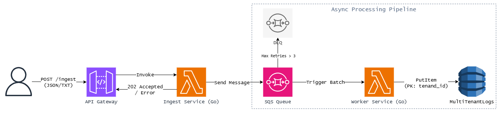

# Robust Data Processor (Go + AWS Serverless)


A high-throughput, event-driven backend pipeline designed to ingest, process, and store unstructured logs with strict multi-tenant isolation. Built using **Go (Golang)** for performance and **Terraform** for Infrastructure as Code.

## Architecture



The system utilizes a **Async Decoupling** pattern to handle burst traffic without degrading performance.

## Key Components

### **Ingest Service (Go):**
- Validates headers and normalizes JSON/Text payloads into a strict internal schema.
- Offloads to SQS and returns **202 Accepted** in sub-millisecond time.

### **Message Broker (SQS):**
- Buffers requests during high-traffic spikes (1,000+ RPM).
- Configured with a Dead Letter Queue (DLQ) for unprocessable messages after 3 retries.

### **Worker Service (Go):**
- Processes messages in batches.
- **Chaos Recovery:** Uses `ReportBatchItemFailures` to only requeue failed records.
- **PII Redaction:** Regex scrubs emails and phone numbers before storage.
- **Latency Simulation:** Simulates CPU-bound work (0.05s per character).

### **Storage (DynamoDB):**
- **Strict Isolation:** `tenant_id` is the partition key, separating tenants physically.
  
---

## Deployment

### **Prerequisites**
- Go 1.21+
- Terraform
- AWS CLI (`aws configure`)

### 1. **Build & Deploy**
Terraform automatically compiles Go binaries.

```bash
terraform init
terraform apply -auto-approve
```

### 2. **Manual Build (Optional)**
On Windows:

```powershell
.\build.ps1
```

---

## Testing & Chaos Simulation

### 1. **Flood Test (Ingestion)**

```bash
curl -X POST "YOUR_API_ENDPOINT" \
-H "Content-Type: application/json" \
-d '{"tenant_id": "acme_corp", "log_id": "101", "text": "User 800-555-0199 logged in from 192.168.1.1"}'
```

### 2. **Unstructured Test (Normalization)**

```bash
curl -X POST "YOUR_API_ENDPOINT" \
-H "Content-Type: text/plain" \
-H "X-Tenant-ID: beta_inc" \
-d "This is a raw log file dump that will take some time to process."
```

### 3. **Isolation & PII Check (Database)**

```bash
aws dynamodb scan --table-name MultiTenantLogs --profile evaluator
```

---

## Evaluator Access

A read-only IAM user `backend_evaluator` is generated for evaluation purposes.

```bash
terraform output -raw evaluator_access_key
terraform output -raw evaluator_secret_key
aws configure --profile evaluator
```

---

## Project Structure

```bash
.
├── ingest/             # Ingest Lambda (Go)
│   └── main.go         # API Gateway handler & SQS Producer
├── worker/             # Worker Lambda (Go)
│   └── main.go         # SQS Consumer, PII Redaction, DynamoDB Writer
├── main.tf             # Terraform Infrastructure (IAM, DynamoDB, SQS, API GW)
├── build.ps1           # Windows Build Script
├── go.mod              # Go Dependencies
└── README.md           # Documentation
```

## Cleanup
To destroy all AWS resources:

```bash
terraform destroy
```